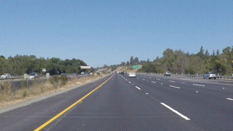

# **Finding Lane Lines on the Road** 

---

:zap: [Jupyter Notebook with Embedded Videos](https://madhurjain.github.io/CarND-Lane-Lines-Project-1/) :zap:

Overview
---

When we drive, we use our eyes to decide where to go.  The lines on the road that show us where the lanes are act as our constant reference for where to steer the vehicle.  Naturally, one of the first things we would like to do in developing a self-driving car is to automatically detect lane lines using an algorithm. In this project we detect lane lines in images using Python and OpenCV.

[//]: # (Image References)

[image0]: ./steps/step0.jpg "Input Image"
[image1]: ./steps/step1.jpg "Color Selection"
[image2]: ./steps/step2.jpg "Grayscale"
[image3]: ./steps/step3.jpg "Gaussian Blur"
[image4]: ./steps/step4.jpg "Canny Edge"
[image5]: ./steps/step5.jpg "Region of Interest Mask"
[image6]: ./steps/step6.jpg "Hough Lines"
[image7]: ./steps/step7.jpg "Weighted Image Overlay"

---

### Reflection

### Lane Detection Pipeline

My lane detection pipeline consisted of _7 steps_:
    
1. We first run color selection on the input frame to select only the yellow and white shades of color and mask all other colors. To do this, we convert the input image to *HSV* _(hue, saturation, value)_ color space. This makes it easier to select required colors using OpenCV's `inRange` function.
   ![Input Image][image0] ![Color Selection][image1]
2. Then we transform the color selected frame to a grayscale frame, to make the edge detection step simpler    
   ![Grayscale][image2]
3. To normalize any noise and sharpness, we perform a Gaussian blur on the grayscale image
   ![Gaussian Blur][image3]
4. We then run the _Canny Edge Detection_ algorithm to detect edges in the frame
   ![Canny Edge][image4]
5. We apply a _Region of Interest_ mask which is a fixed polygon area to only retain the road and remove trees and fence from the frame
   ![Region of Interest Mask][image5]
6. Using _probabilistic Hough transform_ we find line segments in the frame. Then, using `draw_lines()` function we draw the lines on the frame inplace. `draw_lines()` takes all the lines found by the Hough transform, splits them into left/right line segments using their slope, averages multiple segments to get a single line each for left and right lane and extrapolates the line from bottom of ROI to the top. The function also performs a _moving average_ over previously found line segments to smooth out the lane lines drawn.
   ![Hough Lines][image6]
7. We now have a blank image with only the lane lines highlighted in red and the original input image. We superimpose the lane lines image on the original image. This is the final output.
   ![Weighted Image Overlay][image7]

### Potential shortcomings with the current pipeline

This pipeline performs well on all the provided sample data. But, the current pipeline is limited to detecting only the left and right bounds of the current lane. It cannot detect the curvature for a curved road. The other shortcoming is, if the lane lines are not detected for a few frames (due to missing lane lines or traffic), the moving average might yield a wrong result.

### Possible improvements to the pipeline

The pipeline can be improved to detect the curvature of the lane along with the bounds. Also, instead of using simple moving average to extrapolate missing lane lines, we could use a better regression model to identify missing data.